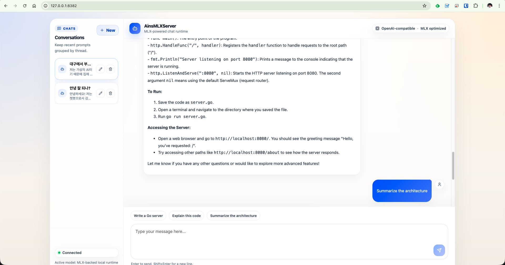

# AinsMLXServer

AinsMLXServer is a high-performance, lightweight LLM server built with **Apple MLX**, **Vapor**, and **SvelteKit**. It provides an OpenAI-compatible API and a beautiful web-based chat interface in a single, zero-dependency executable.

## 🚀 Key Features

- **MLX Powered**: Optimized for Apple Silicon (M1/M2/M3/M4) using the MLX Swift framework.
- **OpenAI Compatible**: Seamlessly use your favorite OpenAI-compatible tools and clients.
- **Embedded Web UI**: A modern chat interface (SvelteKit) is built directly into the binary—no need to manage separate static files.
- **Zero Configuration Setup**: Starts with sensible defaults, but remains highly customizable via YAML.
- **Single Binary Distribution**: Easy to deploy and share.



---

## 🛠 How It Works: The "Embedded Assets" Magic

One of the best features of AinsMLXServer is that the **entire frontend is bundled inside the executable**. 

When you build the project using the provided `Makefile`:
1. The **SvelteKit** frontend is compiled into static HTML/JS/CSS.
2. A **Python script** (`embed_assets.py`) reads these files and converts them into Base64-encoded Swift code (`EmbeddedAssets.swift`).
3. The **Swift compiler** includes this code directly into the final `AinsMLXServer` binary.

**Result**: When you distribute the app, you only need to send one file. The server automatically detects if a physical `Public/` folder exists; if not, it serves the UI directly from its own internal memory.

---

## 🧱 Project Structure

The Swift backend is split by responsibility to keep the codebase easier to scan:

- `Main.swift`: process entry point
- `AppBootstrap.swift`: application startup and shutdown flow
- `Configuration.swift`: `.env` and YAML loading
- `ModelRuntime.swift`: MLX model loading and generation
- `Routes.swift`: HTTP routes
- `APIModels.swift`: OpenAI-compatible request and response types

The frontend build output is still embedded into Swift through `EmbeddedAssets.swift`.

---

## 🧠 MLX Metal Library

MLX on macOS needs a `mlx.metallib` file so the GPU kernels can load at runtime.

This project keeps that file in a fixed build location and links it next to the executable when you run the server.

1. Build the Metal library once:
   ```bash
   make build-metallib MODE=debug
   ```
2. Start the server:
   ```bash
   make run
   ```

For release builds:
```bash
make build-metallib MODE=release
make run-config c=config.yaml
```

Notes:
- `make run` and `make run-config` do not rebuild `mlx.metallib` every time.
- They only create a symlink from the executable directory to `Resources/mlx.metallib`.
- If the file is missing, the Makefile tells you to run `make build-metallib` first.

---

## 🏁 Getting Started

### For Users (Fastest way)

1. **Download**: Grab the latest release for macOS (arm64) from the [Releases](https://github.com/ygpark2/AinsMLXServer/releases) page.
2. **Remove quarantine attribute** (if macOS blocks the app):
   ```bash
   xattr -dr com.apple.quarantine AinsMLXServer-vX.X.X-macos-arm64
   ```
3. **Run**:
   ```bash
   chmod +x AinsMLXServer-vX.X.X-macos-arm64
   ./AinsMLXServer-vX.X.X-macos-arm64
   ```
4. **Chat**: Open your browser and go to [http://127.0.0.1:8382](http://127.0.0.1:8382).

### For Developers (Build from Source)

#### Prerequisites
- **macOS** 14.0 or later.
- **Xcode 16.0+** (Swift 6.0+).
- **Node.js 20+** (for frontend development).
- **Python 3** (for asset embedding).

#### Build and Run
1. **Clone the repository**:
   ```bash
   git clone https://github.com/ygpark2/AinsMLXServer.git
   cd AinsMLXServer
   ```
2. **Install frontend dependencies**:
   ```bash
   cd frontend && npm install && cd ..
   ```
3. **Build and Start**:
   ```bash
   make run
   ```
   This command will build the UI, embed the assets, link the prebuilt `mlx.metallib` from `Resources/`, compile the Swift backend if needed, and start the server.

If you want to rebuild the Metal library explicitly:
```bash
make build-metallib MODE=debug
```

---

## ⚙️ Configuration

AinsMLXServer uses a `config.yaml` file for settings. If no file is found, it uses its internal defaults.

```yaml
server:
  port: 8382

active_model_id: "gemma-2-9b"

available_models:
  - id: "gemma-2-9b"
    path: "mlx-community/gemma-2-9b-it-4bit"
    chat_template: "<start_of_turn>system\n{{ message['content'] }}<end_of_turn>\n<start_of_turn>model\n{{ message['content'] }}<end_of_turn>\n<start_of_turn>user\n{{ message['content'] }}<end_of_turn>\n<start_of_turn>model\n"
    generation:
      max_tokens: 4096
      temperature: 0.3
      top_p: 0.95
  - id: "gemma-3-1b"
    path: "mlx-community/gemma-3-1b-it-4bit"
  - id: "gemma-3-4b"
    path: "mlx-community/gemma-3-text-4b-it-4bit"
  - id: "gemma-3-12b"
    path: "mlx-community/gemma-3-text-12b-it-4bit"
  - id: "gemma-3-27b"
    path: "mlx-community/gemma-3-text-27b-it-4bit"
```

You can specify a custom config file at runtime:
```bash
./AinsMLXServer -c my_config.yaml
```

### Model Notes

- `gemma-2-9b` is the current default active model.
- Gemma 3 models are available in `available_models` as `1B`, `4B`, `12B`, and `27B`.
- The app expects text-generation models that are compatible with the current MLX LLM runtime.

---

## 📡 API Usage

The server provides an OpenAI-compatible `/v1/chat/completions` endpoint.

```bash
curl -X POST http://localhost:8382/v1/chat/completions \
  -H "Content-Type: application/json" \
  -d '{
    "messages": [{"role": "user", "content": "Hello!"}],
    "temperature": 0.7
  }'
```

---

## 🔌 OpenCode Integration

AinsMLXServer can be used directly as an OpenAI-compatible provider in `OpenCode`.

Example project-local `.opencode/opencode.json`:

```json
{
  "$schema": "https://opencode.ai/config.json",
  "provider": {
    "ainsmlx": {
      "npm": "@ai-sdk/openai-compatible",
      "name": "AinsMLXServer",
      "options": {
        "baseURL": "http://127.0.0.1:8382/v1",
        "apiKey": "dummy"
      },
      "models": {
        "qwen-3.6-35b-dwq": { "name": "qwen-3.6-35b-dwq" },
        "gemma-4-31b-dwq": { "name": "gemma-4-31b-dwq" }
      }
    }
  },
  "model": "ainsmlx/qwen-3.6-35b-dwq",
  "small_model": "ainsmlx/qwen-3.6-35b-dwq"
}
```

Notes:
- Start AinsMLXServer first, then launch `OpenCode`.
- The API endpoint is `http://127.0.0.1:8382/v1`.
- `apiKey` is required by some clients even when the server does not validate it, so a dummy value is fine.
- If you use model-specific formatting, define `chat_template` for each model in `config.yaml`.
- `.opencode/` is ignored by Git in this repo, so local OpenCode settings stay untracked.

---

## 🚢 Releasing

To create a new GitHub release locally:
1. Copy `.env.example` to `.env` and add your `GITHUB_TOKEN`.
2. Run:
   ```bash
   make release v=v0.1.1
   ```

---

## 📄 License

Distributed under the Apache License 2.0. See `LICENSE` for more information.
